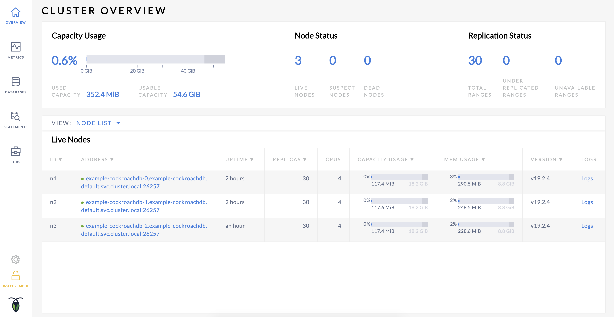
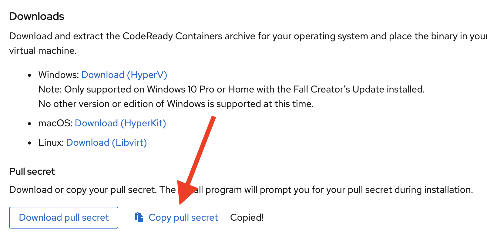
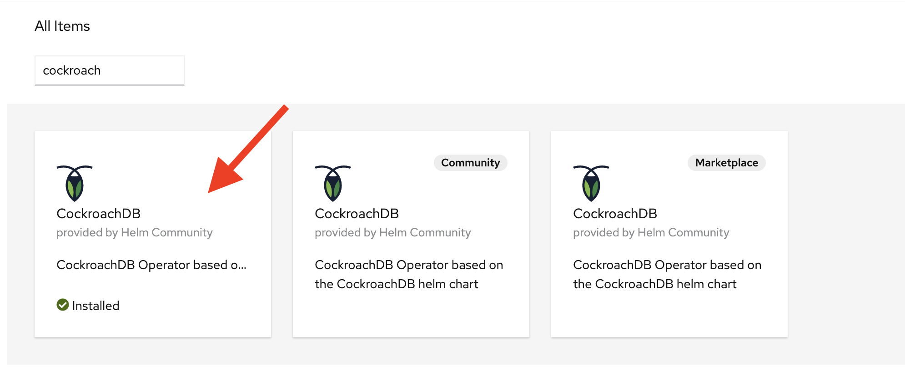

# CockroachDB Demo on OpenShift

A recording of the demo is located on YouTube:

## Download & Install CRC

This setup was conducted on a Mac.  Special thanks to Keith Mc for the assistance!  Here goes...Download load the HyperKit here.  You'll need a RedHat login to do so:

https://cloud.redhat.com/openshift/install/crc/installer-provisioned

Move crc binary into usr/bin/local.  Then run the following:

`crc setup`

`crc start`

When a pull secret is asked for your, you can get this from here:

Paste pull secret into prompt and click enter.

If you run into issues, you can always issue a `crc delete` and try to reinstall.

## Setup CRC

Once crc is done starting up, the command line will issue some instructions for you.  First you should run these two environment setups so you can run `oc` which is OpenShift's version of kubectl:

`crc oc-env`

`eval $(crc oc-env)`

Next, login as the admin from your prompt.  You should be given the kubeadmin and password when crc started.  It should look something like this:

`oc login -u kubeadmin -p <password> https://api.crc.testing:6443 `

Open the console, you can login with the kubeadmin credentials above

`crc console`

## Install the Operator

In the crc console, go to the Operator Hub and search for "Cockroach".  Use the vanilla Operator (not marketplace nor community).  

**Click Install button**

Use the default values (all namespace, stable, automatic)

**Click Subscribed**

This should take a minute or so to setup.

From the crc console navigation, go to Operators -> Installed Operators.

Click on the CockroachDB link under the "Provided APIs" column

**Click "Create CockroachDB" button**

Don't change any values

**Click "Create" button**

Example is the name of the cluster, you can check the pods section of the crc console navigation to make sure the pods initialized.  Or you can run the following from the command line:

`oc get pods`

Lastly, port forward the CockroachDB admin UI

`oc port-forward example-cockroachdb-0 8080 &`

## Demonstration

Make sure you're on the cockroachdb project:

`oc project cockroachdb`

Confirm you can run a cockroach client.  If the client doesn't connect initially, trying us the ip address of the pod instead of the hostname.

`oc run -it --rm cockroach-client --image=cockroachdb/cockroach --restart=Never --command -- ./cockroach sql --insecure --host example-cockroachdb --port=26257`

Once confirmed, you can exit out of the shell.

`exit`

### Run the MOVR workload and kill a node to show resilency

Initialize the workload:

`oc run -it --rm cockroach-client --image=cockroachdb/cockroach --restart=Never --command -- ./cockroach workload init movr "postgres://root@example-cockroachdb:26257/movr?sslmode=disable"`

Run the workload.  You can increase the duration and max rate below if you'd like.

`oc run -it --rm cockroach-client --image=cockroachdb/cockroach --restart=Never --command -- ./cockroach workload run movr --duration=3m --tolerate-errors --max-rate=20 --concurrency=1 --display-every=10s "postgres://root@example-cockroachdb:26257/movr?sslmode=disable"`

While the workload is running, kill node 3 and watch the database self heal.

`oc delete pod example-cockroachdb-2`
